# week 1

This week we are going to cover a simple regression model, we call it simple as it only utilizes one input (or one feature), then will define the goodness-of-fit to evaluate a model.

To optimize our prediction we will use **Gradient Descent** algorithm. This algorithm helps use to **find best value of parameters** which in this case of slope and intercept, then we talk about how we can interpret these parameters.

### Regression Fundamentals

The main example/problem in this course is house pricing prediction. The one input is square feet and the value that we want to predict is the value of the house, i.e. we are looking for a relationship between input and output: $Y_i=F(X_i)$. But we should assume there is some error: $Y_i = F(X_i) + E_i$.

The expected value of $E_i$ is zero, expected value itself means all possible values that error can take weighted by how likely is to take any of them. But what it says here it is equally likely that we are going have positive or negative sales price, $Y_i$ is equally likely to be above or below $F(X_i)$.

**Task 1** - Which model our function should use? should it be:

* Constant relationship (regardless of sq.ft we have a constant price?)
* Linear model? as we increase sq.ft we expect a higher price?
* Quadratic fit? or higher polynomial model? 

**Task 2** - When we choose a model, we must estimate a fit from data! But there are a tons of estimates that we can guess.

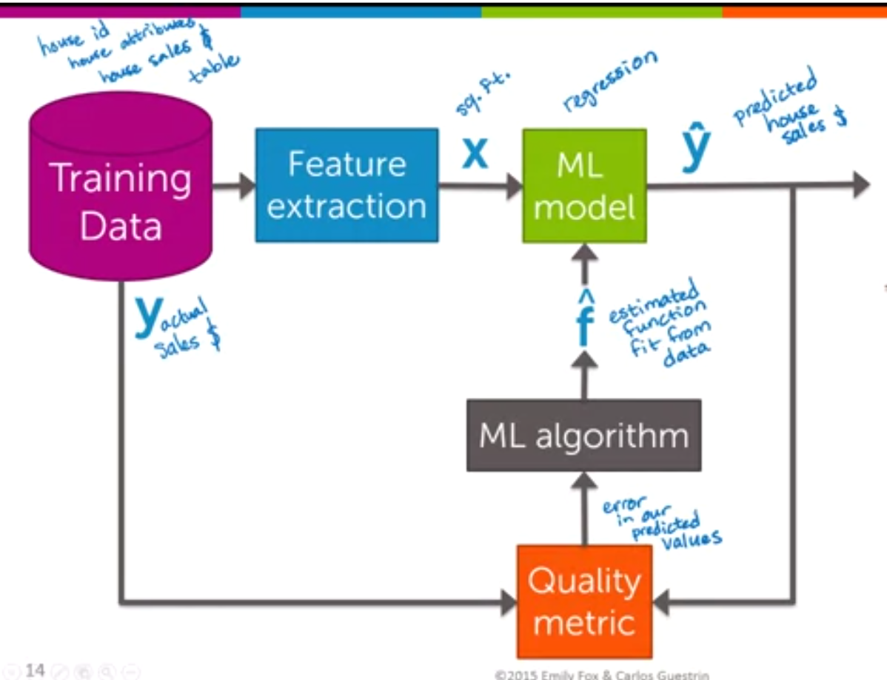

### Simple Linear Regression (its use and interpretation)

As we know a equation of line is: $f(x)  = w_0 + w_1 x$ and we know this too: $y_i = w_0 + w_1 x_i + \epsilon_i$, the parameters in this formula ($w_0,w_1$) or intercept and *slope* are *regression coefficients*. For brevity we show these parameters as $\hat{W}$.

What is the cost of using a specified line? The one we talk about is Residual sum of squares (RSS), a residual is the difference between an estimated and the actual value:

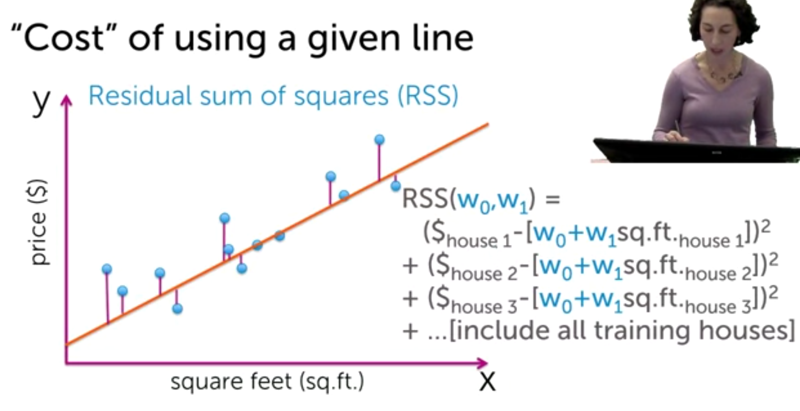

or $RSS(w_0, w_1) = \Sigma^{N}_{i=1}(y_i - [w_0 + w_1 x_i])^2$

Now, imagine we have multiple lines and we want to find **the best** line? Out of all lines, I want to choose **a line the has the minimum RSS**. So our goal is to estimate the parameters that we have in our case $w_0,w_1$, we show the estimated values like this: $\hat{w_0}, \hat{w_1}$.

If we have an estimated model, we can use for predicting the price of a house, by giving its square feet, or we could use it for finding out how big of a house you can purchase with your money!

**Interpreting the coefficients**

Remember the equation of a line: $\hat{y} = \hat{w_0} + \hat{w_1} x$.

* If we set slope ($\hat{w_1}$) to zero then we'd have only intercept which shows the predicted price of a house with zero sq.ft, as you can guess, this is not normally that much meaningful!
* The estimated slope ($\hat{w_1}$): for one square foot what is the predicted change in price? it shows the price of one square feet.

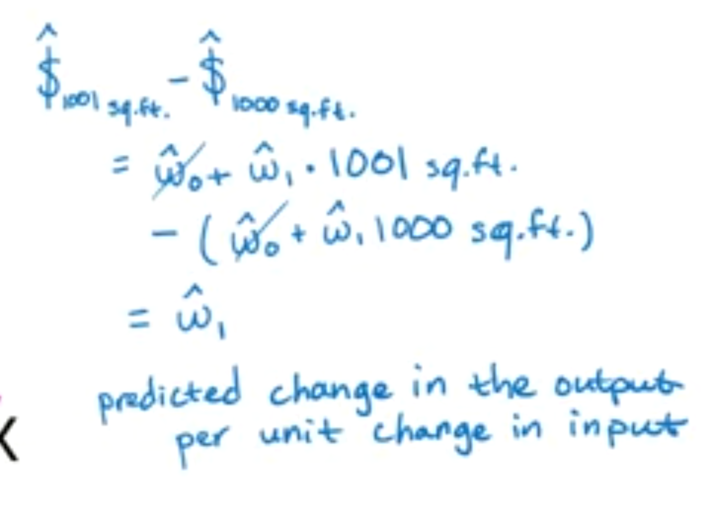

### An aside on optimization (one dimensional objectives)

Now, that we know **what a fitted-line is** and **how to use**, let's talk about an algorithm for **searching over space** of the lines and finding the best one.

We defined our cost function as the following:

$RSS(w_0, w_1)=\Sigma^{N}_{i=1}(y_i - [w_0 + w_1.x_i])^2$

This formula is a function of two variables $w_0, w_1$, and we want to find the $w_0, w_1$ that minimizes our function $g(w_0, w_1)$.

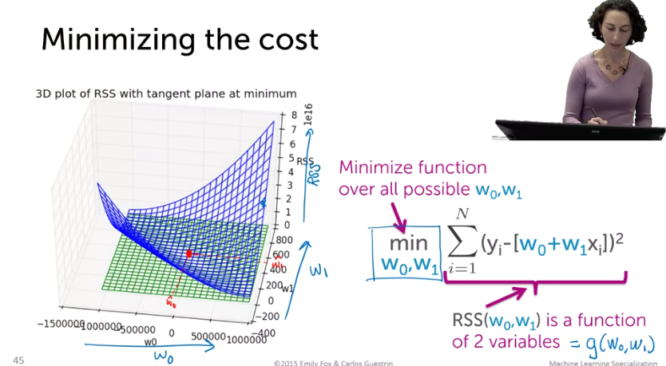

We first define what concave and convex functions are:

* In a concave function, if we connect two points on the curve, they will be below the curve. In a convex function it will be opposite.

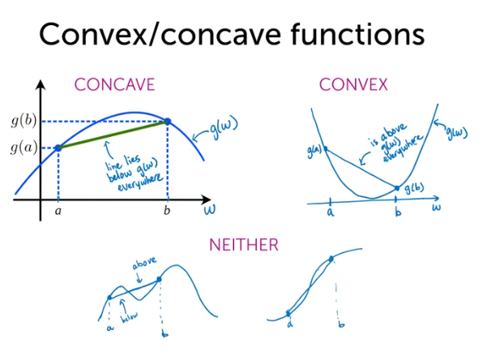

* We are looking for the maximum of a concave function or the minimum of a convex function. In a concave function, the maximum is the point that derivative of that is equal to zero. While in the convex function, is where derivative is equal to zero. However, in the other figure (bottom-left), there might be multiple points that their derivative is equal to zero and the last figure (bottom-right) has no solution to derivative = 0.

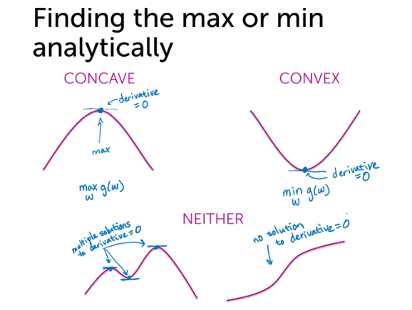

How do we know if we are at the minimum or maximum of a function? well, you can calculate the second derivative of it.

Finding the derivative of the function:

$g(w) = 5 - (w - 10)^2$

$\frac{dg(w)}{dw}= 0 - 2 \times (w - 10) \times 1$ = $-2w +20 = 0$; $w = 10$

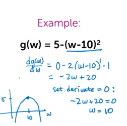

That was one way of finding the minimum or the maximum of a function, getting the derivative of the function and setting it to zero. But, there are other algorithms like **hill-climbing** where it is going to be an iterative, by changing the value of w.

At the beginning we don't know either we should go left or right to get the optimal value. What can I do? taking the derivative, if the derivative is positive, this is the case that I want to increase the w.  For the second point at the figure, the derivative is going to be negative. If we split the figure into two halves, on the left side the derivative of $g(w)$ is going to be positive, on the right side it is going to negative. And when you are at the exact optimal point, the derivative is equal to zero. So, this is the derivative that tells me what to do.

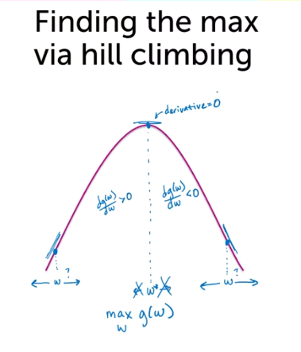

How does the algorithm work?

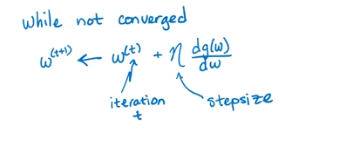

* We the stepsize to control how much we move.

We can also use the hill climbing algorithm to find the minimum of a function. We'd get the derivative of the function. On the left side, the derivative is negative and I want the achieve the minimum; it is going to move to the right. On the right side of the figure, the derivative is positive and while we want the minimum so we should keep looking on the left direction. Probably, it is better to call this, hill descent; the algorithm is the same except we have a minus sign:

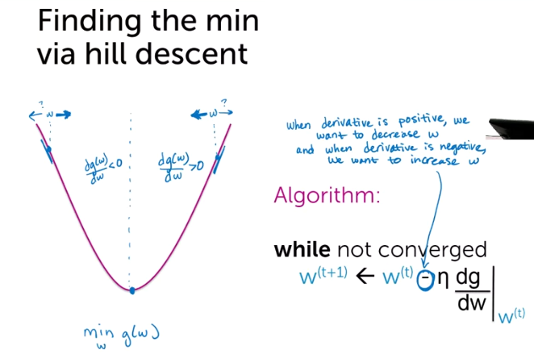

* We mostly use convex function in this module.

Choosing step-size and convergence criteria:

* Fixed step-size: you might jump around a lot and you might also converge very slowly. If the function is strongly convex, the fixed step-size approach works.
* Another choice, which more common, is to decrease the step-size after t operation. Step size is decreasing with the number of iteration. *Why this makes sense?* Because, typically, when we start we are far away from the optimal point, but as we progress, we get closer to the convergence point.

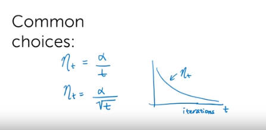

Another important design decision is when we should stop our algorithm? We know at the optimal point the derivative of the function is equal to zero. In practice, the derivative is going to get very small, that would suffice. So, we need to specify a criterion, and we reach to that range we are going to stop the algorithm (threshold).

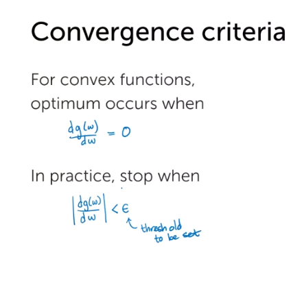

### An aside on optimization (multidimensional objectives)

Up until now, we only talked about getting derivative a function with only one variable, but in our RSS formula we have two variables, and we want to minimize over both variables. Instead of derivative, we are going to talk about gradient and what gradient is?

Gradient of a function is a vector of partial derivative of different parameters.

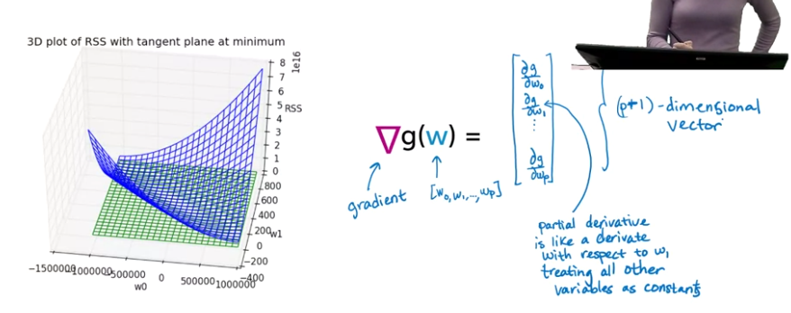

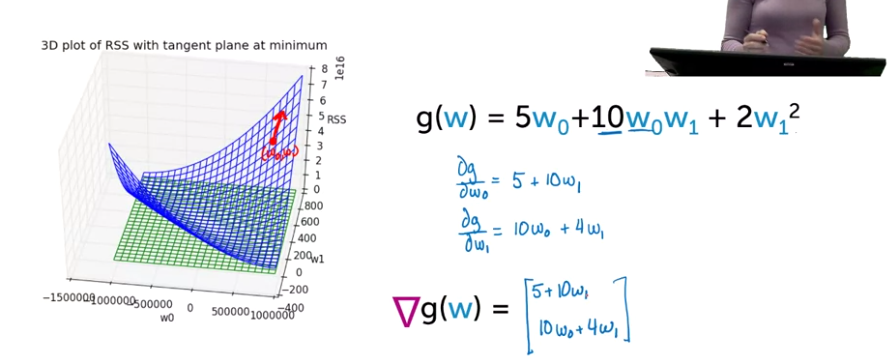

At any point, we can replace the variables with that point values and we get a vector of values.

There are different ways to illustrate the function that we are optimizing over it. Instead of a mesh plot  (3D) that we have had so far, we can use a contour plot (2D).

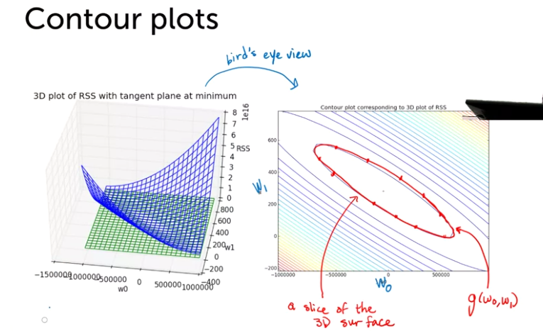

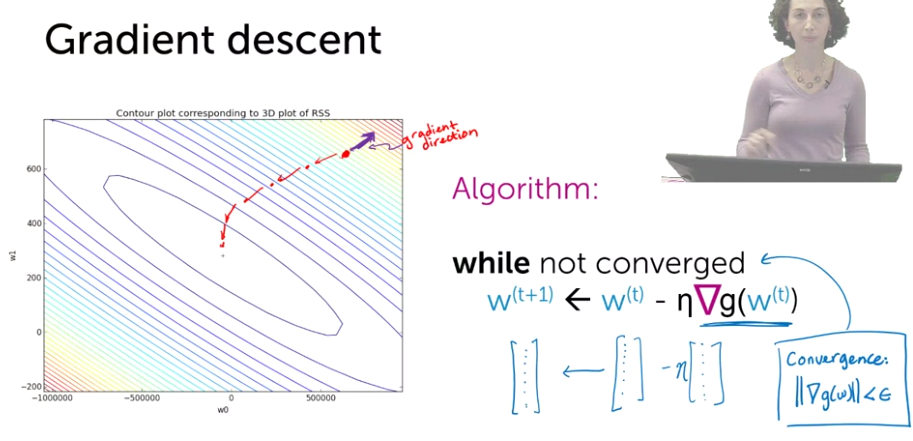

In the above figure (bottom-right) we are looking at the magnitude of the gradient of $g(w)$, an when it is smaller than our predefined threshold we say it is converged.

### Finding the least squares line

Now that we all know about the optimization behind the scene, it is time to find the line with the minimum cost.

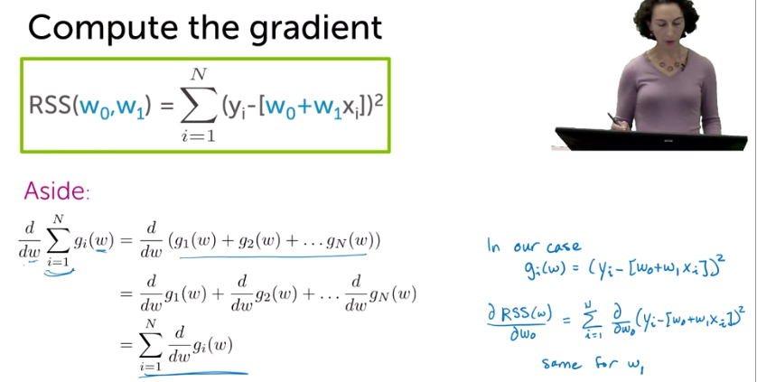

 We want to compute the gradient part, so according to the our formula we should take partial derivative:

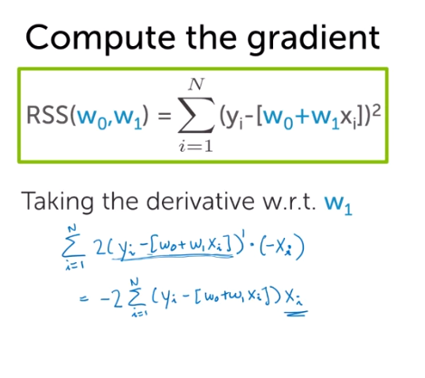

 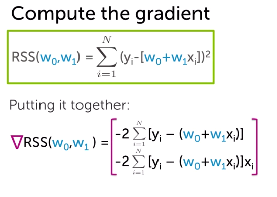

Now that we have the gradient, we have two options to find the minimum, just like the beginning, we can either set it to zero, or we can use the gradient descent approach.

**Approach 1**: Set gradient = 0

Set it equal to zero and solve for $w_0$ and $w_1$.

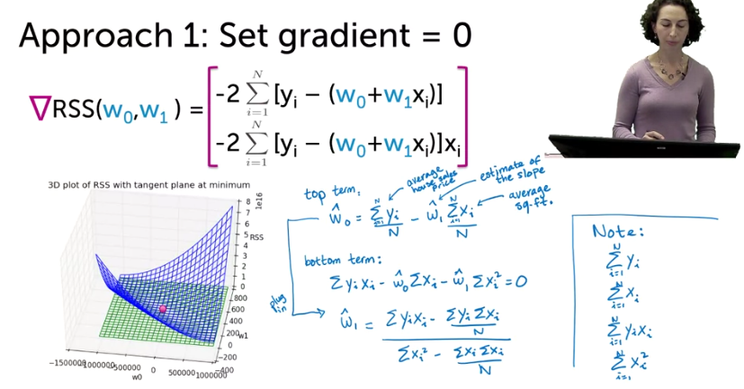

The point is, it has a close-form, it is pretty straightforward and go compute this. We only need to compute the formulas on the bottom-right side. The takeaway is that one way to solve the minimization of residual sum of square is to the gradient and set to zero.

**Approach 2**: Gradient descent

The other approach we can take is to do gradient descent, trying to get the minimum.

Let's re-interpret what we have:

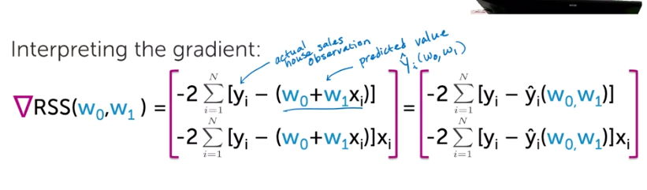

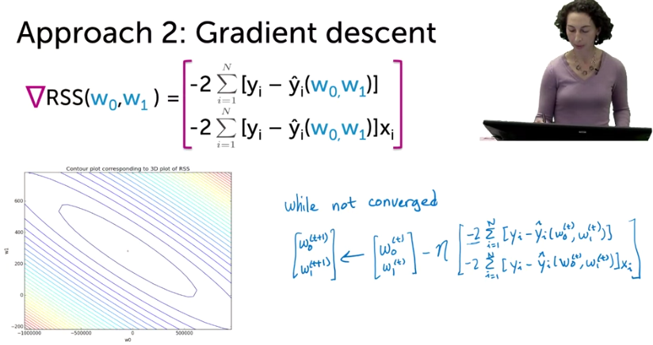

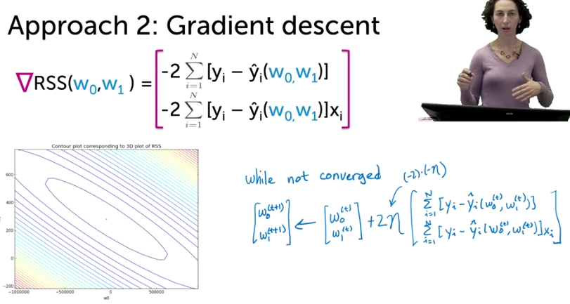

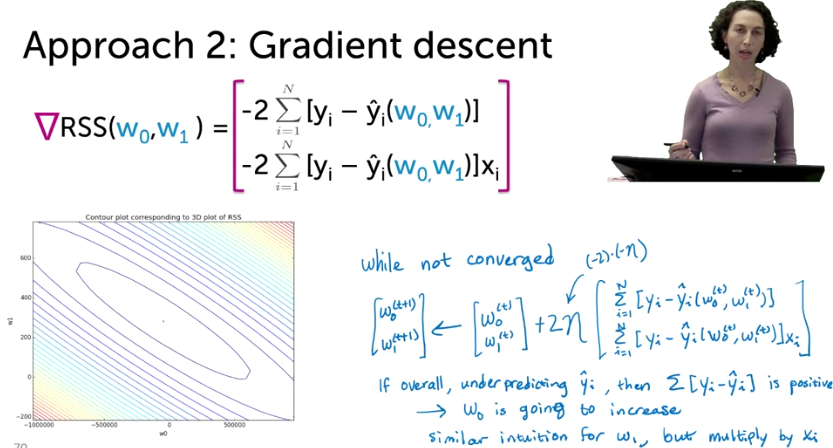

* If overall, we underpredicting $\hat{y_i}$, the subtract it with $y_i$ is going to be positive, so at the end, it will cause $w_0$ to increase which makes sense, we unpredicted, but the formula increase it; to fix the our estimation.

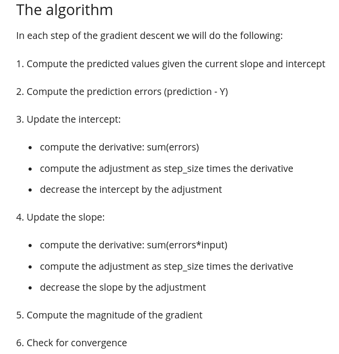

Comparing the approaches

* Firstly, for most ML problems, cannot solve gradient = 0, why probably because there are a tons of features and even if it was feasible, gradient descent will perform better and it is more efficient.
* *Gradient descent* relies on choosing **stepsize** and **convergence** criteria.

**High leverage points**: Is a point along the input axis and is an outlier, for instance, the point which has crime-rate above 350 was a high leverage point. It is very very different from others. It influences the close-form solution severely.

**Influential observations**: Just because an observation is a high leverage point does not mean it is going to influence the data strongly, because it might follow the trend of the data. However, it has the potential. Influential observation <u>is an observation that if you remove it from the data you'd get a very different fit</u>. Other observations that are not leverage points can also be influential observations, the potential for doing so, is much less.

* Residual sum of square is something which is called **Symmetric** cost functions; because it has same cost if we over-estimate or under-estimate. In some situations, one of them could cost more! Then we should look for **asymmetric** cost functions.

Week 2:

- [ ] mutiple features of one input
- [ ] incorporating multiple inputs
- [ ] setting the stage for computing the least squares fit
- [ ] computing the least squares D-dimensional curve
- [ ] programming assignment

