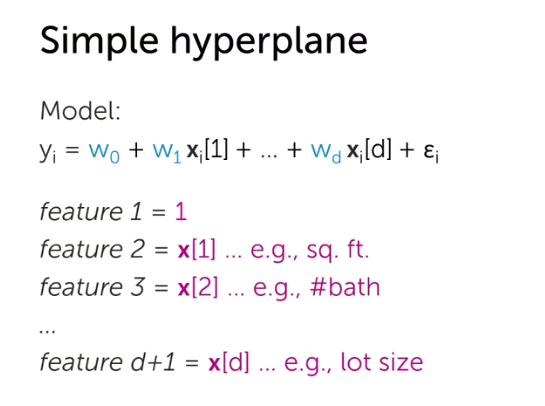

# Multiple Regression

Goal of this week is to run the regression algorithm using multiple features, which seems more practical than a single feature, right?

### Multiple features of one input

In a lot of cases, we are going to be interested in more c**omplex functions** of our input. why? Because often there is not a linear relationship between single feature and the output, the relation might be more complex. Let's say it is a quadratic function.

Or we might have a higher order polynomial relation:

Still, we have one input (sqft_living), but we want to use different features of that single input. <u>Features are just some function of your input</u>.

Why we need to have different features of the same input? The instructor mentioned the house prices during 20-year period, if you only use single feature we considered only the linear relationship among them, house prices tends to be different during different seasons, so we need a function to capture the **seasonality**:

If we apply the previous model to the house seasonality trend, before doing this our model was unable to capture the seasonality trend.

Where we see seasonality? In weather modeling, such as temperature, rainfall. Or in  Flu monitoring.

More generally any function of our single input is possible, so we are going to make our model more general:

So, if we want to update our block-diagram, the output of feature-extraction is no longer a simple X (input(s)), it is a $h(x)$, it is our features of input X.

### Incorporating multiple inputs

So far, we have been talking about how it makes sense to have multiple features of one input, but even that models cannot grasp the whole trend behind the dataset, and we need literally **more inputs** to understand the flow of the data. For instance for the house pricing problem, we are going to use number of bathrooms in addition to the square feet.

So now, we'd have a higher dimensional space:

**General notation**

So from now on, we our generic regression model with multiple features using below notation:

For future reference, N is the number of observations in the dataset, how many examples we have, and input are things like sq.ft, number of bedrooms, parking and other things. While features are some functions of the inputs, so there is no obligation that $d$ should be equal to $D$.

### Interpreting the coefficients

To understand the meaning of each coefficients, we should fix other coefficients and then consider the effect of the single coefficient that we are interested in.

sometimes, there is an implicit relationship between inputs, for instance number of bedrooms is kind of indicative of the house's size. So, you should think about the coefficients in the context of the model, not single coefficient alone.

Now, let's try to interpret the coefficients of a single input but multiple features! We cannot fix the cannot fix the coefficients here because everything is related to the others.

### Setting the stage for computing the least squares fit

On this lesson, we are going to convert the computation into matrix notation.

Rewrite in matrix notation for all observations

What is the cost above calculation:

Previously, we used this formula:

Now:

We did was, we transform our RSS cost function into matrix notation and we also explained the meaning of the transpose, which we used instead of power of two.

## Computing the least squares D-dimensional curve

As we saw in the simple regression, gradient was important for both closed-form solution and the gradient descent algorithm.

She didn't give the proof behind as it was complex, instead she showed how it would be if the matrix was one dimensional.

Now, that we have the gradient of $RSS(w)$, let's use the **closed-form approach** and set it zero and solve for $w$. What's good about the closed-form solution is that we have a nice formula and it requires nothing than computation!

A discussion about the closed-form:

* For this approach we need to take a inverse of a matrix, it is invertible if the number of *observations* is bigger than the number of *features*, $N > D$. (number of linearly independent observations). <u>The takeaway is that, in some cases taking the inverse might be impossible</u>.
* A related point to consider is the complexity of the inverse functions, which is $O(D^3)$, number of operations we have to do to invert this matrix, scale cubicly with the number of *features* in our model. In some situations it is that much computationally intensive which is impossible to do. Takeaway: when number of features is really huge we cannot use this approach, how do you define huge here? $100,000$ features

**Approach 2**: Gradient descent

As you remember (hopefully), we initialized our parameters somewhere and take these gradient steps and eventually we will converge to the optimal of this problem. What is this doing is taking the entire coefficients and update them all together (**all at once**) using matrix notations.

Updating coefficients **all together** (at once) can be problematic (computationally), so we are looking to update them feature-by-feature. We are going to solve the RSS formula for $j$ feature and then use that for inside the gradient descent algorithm.

Summary of gradient descent for multiple regression

* **magnitude** of the gradient is equal to multiply the vector to its transpose and then taking the square root.

