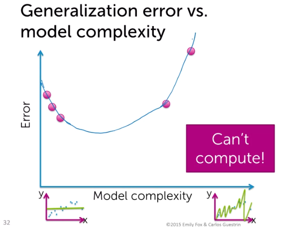
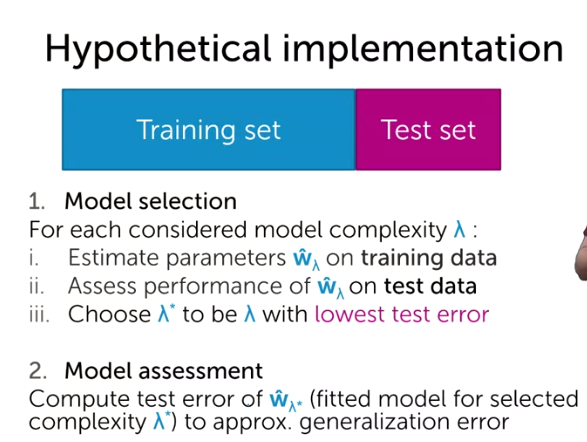

# Assessing Performance

Our goal is to analyze the performance of a trained model.

### Defining how we assess performance

For example in the house pricing exercise, we might lose money due to inaccurate listing price: 

* Too low -> low offers
* Too high -> few lookers + no/low offers

So the question is, how much am I **losing** compared to perfection?

We do this using a loss function, $L(y, f_\hat{w}(x))$, the loss function $L$, somehow measuring between these two things, a couple metric examples:

* absolute error: $|y - f_\hat{w}(x)|$
* squared error: $(y - f_\hat{w}(x))^2$

### 3 measures of loss and their trends with model complexity

1. **Training Error**: The first measure of assessing the loss is the **training error** which is when we use a subset of the data to train our model and minimize the RSS. After we fit the model we measure the error against the same dataset! below measure is the average loss:

another famous measure is RMSE (root mean square error), people use this because after you'll get the root, it makes more sense than the average mean error, the unit will be in dollars in the house pricing problem.

Now we are going to see how model behaves as model complexity increases, to start with we think our model is a constant model, due to its simplicity, then if you switch to a linear model, we'd get a better model, then quadratic function, then higher polynomial which decrease the error significantly.

* Is training error a good measure of predictive performance? How do we expect to perform on a new house? Training error is **overly optimistic** because $\hat{w}$ was fit to training data. Overall, training error does not mean good predictions, unless training data includes everything you might ever see. 

2. **Generalization** (true) **error**: Taking the average value of our loss weighted how likely those pairs are in our dataset. Error vs model complexity for generalization error: at the beginning it's better than training error as we have how likely it is to happen; but as the model gets complex it will perform horribly: because these complex models that fit the training data very well but generalize to other houses we might see so the diagram is U shaped. But in contrast to training error, we **cannot compute the generalization error** because everything was relative to the true distribution of real-world which we don't have.

   

3. **Test Error**: As we cannot use the generalization error in real-world, we go for another approach which is called test error. In this method, we'd split the dataset into two halves, and use one part for training the model and the other part for testing the model, in other words, it is unseen data which we might see in the real-world.

   1. Test error: avg. loss on houses in test set $\frac{1}{N_{test}}\sum_{i}L(y_i, f\hat{w}(x_i))$. So we train our model on training set, but we evaluate it on test set to make sure of its generalization.

   

Over-fitting:

These are the models that are really highly fitted on the training dataset but don't generalize well.

Conclusion: we know that we should split the dataset into two halves but by which ratio? If the training set are too few, then the fitted model will perform poorly; while if I put too few into the test set, it will give me **a bad approximation of generalization error**. This assumes you have enough data for both training and test sets, if you don't have you might go for better methods like cross validation.

### 3 sources of error and the bias-variance trade-off

In forming predictions, there are **three** different sources of error:

1. Noise
2. Bias
3. Variance

Noise: Data are inherently noisy, the epsilon term represents the error, there is also a variance of noise which is the spread of that noise. This is has nothing to do with us. We call this <u>irreducible error</u>. But what we can control are bias and variance. 

Bias contribution: Bias is the difference between the average fitted model (average among all fitted models) and the true function. It says, is our model **flexible enough** to **on average** be able to capture the true relationship between square feet and house values, in this case it is too simple there is a huge difference so we call this **high bias** and it leads to error in our predictions.

Variance contribution: How much fits can vary, it they can **vary** much, then you'd have **erratic predictions**, your predictions would just be sensitive to what dataset you've got.

In the below picture, the dataset for both fits are the same except for the right figure we only changed two observations and as you can see, it changed **dramatically**.

At the below figure, we got the average fit model and as it can be observed, they vary too much. So <u>high complexity models have high variance</u>. <u>But the bias of high complexity models is very very low</u> (remember difference between true fit and average fit=bias), so on average a high-complexity model can precisely capture the true relationship:

**Bias-variance trade-off**

In the below diagram, we look for the sweet spot, we want to be there, but just like generalization error we **cannot** compute bias and variance and then computing the MSE (Mean Squared Error), because they're defined based on the **true function** of the data <u>which we don't have</u>.

Another thing we can look at are measure of error as a function of number of data points (**for a fixed model complexity**):

* if we have a small dataset then the error is high, but as we grow the dataset, the error decreases but there is a limit on that because of the bias and inherent noise.
* Training error, on the other hand, we have just a small dataset, the error is small because a fixed complexity model can find out the relationship reasonably well. But as the dataset grows, that same complexity of the model cannot fit all data points very well.

### Putting the pieces together

We have two steps almost in any machine learning algorithm:

* Model selection: During this step, we need to choose tuning parameters (aka hyper-parameters) which controlling the model complexity. The question is how can we think about choosing the hyper-parameters. One implementation might be to split the dataset into two halves (training, test):

​		At the first glance, it is obvious that is the same problem which we encountered before. We are training the $\hat{W}_\lambda^*$ on the test set. It is really overly optimistic (training error).

What we can do to remedy the problem? Create two test data sets.

* Model assessment: assess the model generalization error.
