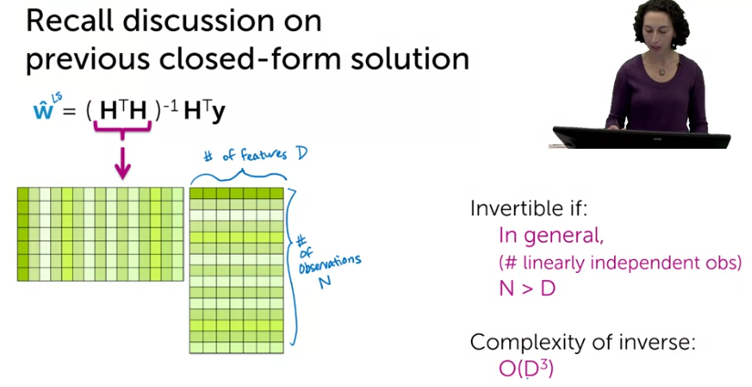

# Ridge Regression (Regularization)

### Characteristics of overfit models

In the previous week we talked about the complex model that becomes overfit to the data and also discussed this idea of bias and variance trade off. Where high-complexity model could have very low bias but high variance; whereas low-complexity models have high bias but low variance. This week we talk about a way to <u>automatically balance between bias and variance</u> using something that is called **ridge regression**.

In the below picture, on the left side we have low order polynomial, on the right side we a high-order polynomial which suffers from high variance and low bias; in other words it is being overfit.

**Symptom of overfitting**

* is there some type of quantitative measure that is indicative of when a model is overfit? Well, when a model over fits, the <u>coefficients tend to really large in magnitude!</u>
* This is problem is not unique to polynomial regression, it happens if we have a lot of features (very large $D$).
* If number of observation is small, then it more likely that overfitting happens. But if the number of observation is high, we are not going to quickly become overfit; because we have dense observations.

* Number of inputs influence overfitting: if we only have one input we should a dense input to prevent the model from overfitting which is hard because it might not be possible to gather that much data. and it becomes harder if you have different inputs, because you are required to have examples of all possible combination to avoid overfitting.

So, not only the number of observations matters, but also the density of it is important as well. But it seems solving this by providing more data is hard. Hence, we need another solution to fix this problem.

### The ridge objective

Here, we want to automatically fix this issue by modifying the cost term. Up until now, the quality metric only took the estimated price and the actual price and tried to minimize that, but now, we want to modify to also take into the account the measure of complexity of the model.

Here, the idea is that we not only want to find a model which fits the data, but also want to control the magnitude of the coefficients, that will be our new cost function:

Now, we need a term for measuring the magnitude of regression coefficients:

* sum of coefficients: This is the optimal term, as two term might cancel each other out or produce a small number, while themselves are large.
* sum of absolute value of coefficients? $|w_0| + |w_1| + \dots + |w_D|$  = $\sum^D_{j=0} |w_j|$ , there is a name for this equation which is called **L1 norm**, this is a reasonable choice but we discuss this next week.
* Sum of squares (L2 norm): $w_0^2 + w_1 ^ 2 + \dots + w_D^2 = \sum^D_{j=0}w_j^2$

**Consider resulting objective**

We like to be in control of RSS and the magnitude of coefficients

When $\lambda$ is in between, it is bigger than zero and it will be less than when we set the $\lambda$ to zero. So, the more interesting question is what value we should? well it depends how much we want to go away from the magnitude of the coefficients.

How this new term is going to affect the bias and variance:

**Coefficient path according to the lambda value**

We know if we set the lambda to infinity we'd get very very small coefficients approaching zero.

Below figure shows as you vary lambda from zero up towards infinity how my coefficients change (for every different $\lambda$ we get a different solution):

* When lambda is set to zero, the weights will be equal to a simple least square model.
* As I increase lambda up towards infinity, I see my solution approaches zero.

### Optimizing the ridge objective

For now, we imagine someone gives us the right lambda, let's discuss how we fit this model?

Now that we have this we can start we did in the past, taking the gradient set it to zero or use the hill descent approach.

Now we have the gradient we can choose either closed-form solution for iterative one.

**Approach 1**: closed form

Interpreting ridge closed-form solution:

* if $\lambda=0$: $\hat{W}^{ridge}=(H^TH)^{-1}H^Ty$ and this is the old closed-from solution.
* if $\lambda=\infty$; then $\hat{W}^{ridge}=0$ because it will be like dividing over $\infty$.

Previously we said closed form solution works if:

Now, before taking the inverse we adding the identity matrix; this matrix is invertible if:

* the matrix is invertible, **always if** $\lambda > 0$, even if the number of observations are less than number of features. So the L2 term is making the matrix more regular. As we talked about it before, this closed solution can be computationally prohibitive, so we switch to the second approach.

**Approach 2: Gradient descent**

If we want to make the equation simpler, we can factor $w_j$, the value inside the parentheses is negative (because both alpha and lambda are more than zero so 1 - 2 (positive_number) is negative). But we want the value of the term inside parentheses to be positive to enforce that we say ($2\alpha\lambda$ should be less than one). 

Then we are multiplying the previous weight by a small number (1 - less than one) so we are making the weights smaller.

In the ridge regression the very first thing we do is shrinking the coefficients. We ask for smaller coefficients; then we use the update-term to fit to the data, we are modifying the shrinking coefficients.

Old iterative function

New solution: As it can be seen, it is very very trivial modification to the code we had.

### Tying up the loose ends

We discussed that having just a training and testing dataset is not enough as we might want to tune hyper-parameters. So we needed three data sets (training, validation an d test). <u>This solution makes sense only if we have sufficient data</u>.

But what if we don't have enough data? We can use the KFold cross validation to get the cross-validated scores. It will splits the dataset into k folds and each time train on k-1 and put the 1 fold for testing. [Some](https://queirozf.com/entries/scikit-learn-pipeline-examples) say even in this stage it is good idea to put the testing data set aside and train the `cross_val_score` on the training dataset.

The instructor also used different value for lambda and perform for each value of lambda an entire k-fold cross validation and at the end chose the lambda that produced minimum error on average.

cross-validation is really great algorithm for choosing your hyper-parameter or when you don't have enough data:

**How to handle the intercept**

Up until now, we assumed that $h_0(x_i)$ is set to 1.

So, it makes sense to add a column at the beginning of the H matrix which hold 1 for each observation's intercept.

* But do we have to penalize intercept? Regardless of how many features  you have in your model, does that really matter how are we thinking about magnitude of the intercept? No really.

* But how to prevent $w_0$ from penalizing?

  * **Option 1**: might be to treat like a special case:

  

  Now, let's look at how to implement this in closed-form solution or iterative one:

  

  Doing this in the iterative solution is even simpler:

  

  * **Option 2**: Center data first, we don't need to worry about this issue and we are not going to change either of the approaches:

    

* Centering a variable is subtracting the mean of the variable from each data point so that the new variable's mean is 0;  *Standardization* is slightly different; it's job is to center the data around 0 and to scale with respect to the standard deviation (where *μ* and *σ* are the mean and standard deviation of the dataset)

  ​	$x_{standardized}=\frac{x−μ}{σ}$
