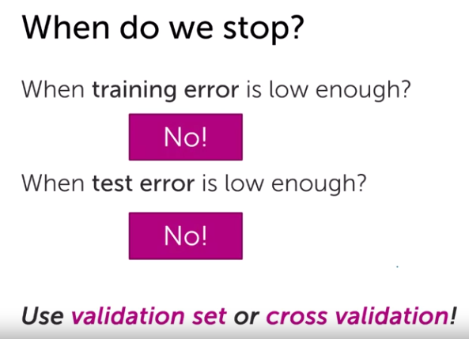
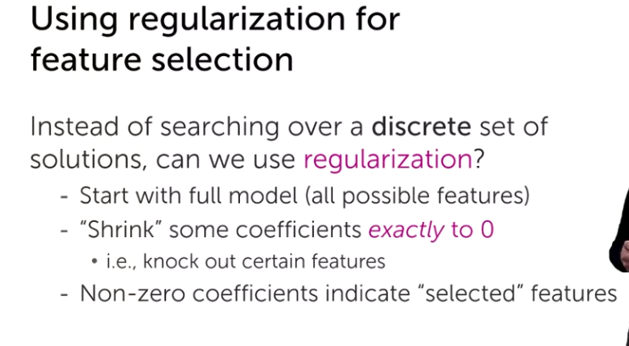
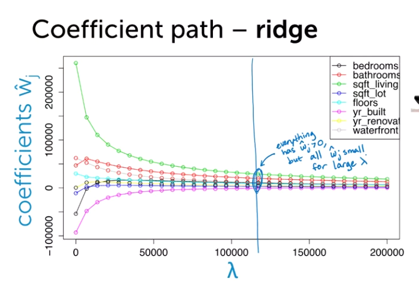

# Feature Selection & Lasso

### Feature selection via explicit model enumeration

For instance, in the house pricing problem, there might a tons of features that the contribution of them to the prediction is negligible. We are looking for the smallest subset that produces the result.

What options do we have?

Option 1: All subsets:

It starts with no features

Then it will search over all models with one features and select on that has minimum error:

Then best model with two features and need not contain the feature in the previous model:

What model we would choose among them? we know as a model gets complicated it is going to get more over-fit and it does not generalize well. So we can use previous methods like validation set or cross validation.

Complexity of 'all subsets':

If we cannot use the all subsets option, then what other option we have?

Option 2: Greedy algorithms: Unlike the option 1, in this method, we keep our previous feature in the model and then we ask for the next best thing.

From iteration to another iteration error never increase and eventually the training error will be equivalent to the option 1.

When do we stop?

We should not touch the test error while training our model as it will leak the test data to the algorithm.

### Feature selection implicitly via regularized regression

The third option is using regularized regularization to implicitly perform feature selection for us.

* Why don't we just thresholding ridge coefficients? We only select features that are above a certain threshold and set others to zero.

One interesting point is that our model just ignored both number of bathrooms and showers which literally are them same; as you expect each bathroom to have a shower.

If I hadn't included number of showers, then the ridge regression it would have placed that weight on the number of bathrooms. So, the number of bathrooms could have been in the selected features!

* More formally, if you have a number of features that are strongly related, statistically called **strongly correlated features**, <u>ridge regression is going to ignore them as the coefficients of these features are small</u>.
* Can regularization lead directory to sparsity? 

What if we use another cost instead of L2 term:

As of yet, it is not clear why this L1 term leads to sparsity, but let's explore this visually:

In the L2 term we had this figure which showed as we increase the lambda term, all weights are going to be punished with the **same amount** even for a large lambda weights are close to zero but they're not zero.

On the other hand, Lasso is going to give us a sparse weights, the below figure shows how important the `sqft_living` is.

### Geometric intuition for sparsity of lasso solutions

Now we are going to see why we get sparsity in our lasso solution; we are going to do this geometrically. We first evaluate ridge cost then we move on the lasso.

If we solve the RSS(W) for ridge we get the equation for the <u>ellipse</u>. If we just minimize over the RSS we reach to the red cross.

But what will happen if we have only the ridge term? we will get the equation of a <u>circle</u>. We would eventually reach to the zero if the lambda is going towards infinity.

No what will happen if combine these two terms together ($RSS(W) + lambda ||w||^2_2$). As the lambda penalty increases the weights of the ridges decrease until they reach to zero. Now lets see the result of combining these two (the big circle is the rss and the point in the middle of it is optimal point) and solution to this combination is the where these two circles meet each other and you can it drives the least square far away from its optimal point which is highly overfitted over there.

If you choose larger lambda; it will result in larger rss.

Now lets do this for the L1 term. for the first part if we expand the RSS we'd get an ellipse equation.

But now let's look at the term which is different (L1), when you expand the L1 term you'd get the diamond equation, if we are just trying to minimize the L1 term we reach to the zero point:

Now let's combine these two wonderful terms and see what is going to happen the path of this is going to be different than the ridge. Now let's understand why it gives us a sparse solution:

Because of this diamond shape of the L1 objective, <u>we are going to have some probability to hit those corners which will result in some features will be set to zero and this is why Lasso results in sparse solutions</u>. Below figure is 2D but if we imagine in d-dimensional we are very likely to hit one of those corners. So unlike ridge regression we are punishing all weights.

* Ridge and lasso regression allow you to regularize ("shrink")  coefficients. This means that the estimated coefficients are pushed  towards 0, to make them work better on new data-sets ("optimized for prediction"). <u>This allows you to use complex models and avoid over-fitting at the same time</u>.
* In contrast to Ridge, the LASSO regularization will actually **set less-important features to 0** and help you with choosing the features that can be left out of the model. 

### Setting the stage for solving the lasso

As you might remember, we take the gradient of the cost objective and then we either use the closed-form solution or gradient descent algorithm. We should do this for the lasso either.

We know the derivative of the RSS(W) but what is the derivative of the $\lambda(||W||_2^2)$ , if we plot the diagram for absolute value function we get something like below figure and the derivative for the left side is negative $-1$ while for the right is $+1$. But what is the derivative for the center point (zero), it turns out it has no derivative.

**Issues**

1. We have a new concept here called sub-gradient which is important for the Lasso term, because we have no derivative at some points.

2. Even if we could compute derivative, there is still no closed-form solution.

**Aside 1**: Instead of gradient descent or sub-gradient descent let's use this opportunity to teach a really important optimization technique, coordinate descent. Then we're going to use the coordinate descent to solve the lasso objective.

Our goal here is to minimize some function $g$. and we know, often, <u>it is hard to find minimum for all coordinates</u>, but it is easy for each coordinate (single dimension and keep all other dimensions fixed).

**Aside 2**: Normalizing features, by doing this operation it is going to put each of our features into the <u>same numeric range</u>. No matter what function you use for normalization you have to use the same for the test data set, otherwise you're mixing up apples and oranges. <u>Sum of a normalized feature then will be equal to  one</u>.

**Aside 3**: Coordinate descent for regularized regression:

* We're going to look at specific value $w_j$ and we are gonna hold other features fixed and we're going to optimize with respect to $w_j$.

Intuition behind it: If these things gonna agree, row j is gonna be very large. If they don't agree then row j is going to be small and will not put much weight on this feature in the model.

### Optimizing the lasso objective

In the case of Lasso, how we set $w_j$ is going to depend the value of tuning parameter $\lambda$, but how does that relate to the row j ($p_j$) correlation?

* If it is small, what small means is determined by $\lambda$, we are going to set the $w_j$ to set.
* If it is very positive or very negative we are going keep that but we are going to decrease the weight by $\frac{\lambda}{2}$.

* If $w_j$ falls between $\frac{\lambda}{2}$ range means there is not a correlation between the residual and features (without $w_j$ in our model), so we are going to completely eliminate that feature, by setting it to zero.
* But if that is outside that range, we still going to include that feature, but we shrink that compared to the normal least square. This is the difference between lasso and ridge, as ridge shrinks the coefficients everywhere, but not strictly to zero.

* How do we assess convergence in Lasso?

  Here, we don't have gradient to take the magnitude of them as we did in the gradient descent, so we need to do something else. One we know, though, is that in the strongly convex problem as we move towards the optimal our steps are getting smaller and smaller. We should perform the coordinate until all step sizes are getting smaller and if the max of the step size for all features is less than $\epsilon$ then that's one way.

  

* There are other solvers for lasso such as LARS (old), but nowadays Parallel CD or ADMM are more common, as they are faster.

Coordinate descent for Lasso (for unnormalized features):

What we used for normalized features:

The only changes we need to make is the highlighted green boxes, for each one of our features we need to precompute the term $z_j$, and that's exactly equal to our normalized formula:

### Tying up loose ends

One we didn't answer so far, is how do we choose the $\lambda$ term? Just like other hyper-parameter if we have enough data we can choose the best $\lambda$ by following the below instructions:

If we don't have enough data, use cross validation:

* But in the case of Lasso, using the $\lambda$ that provides the best accuracy tends to favor less sparse solutions and thus smaller $\lambda$ than optimal choice for feature selection.

Some practical notes related to Lasso:

1. Lasso shrinks coefficients relative to LS solution, i.e. we'd get more bias and less variance. But we might still want to have low bias what we can do is that to run the Lasso and find out which features are important and the run the Least Square solution using these features in this case the weights are not penalized and we have less bias then. This process is called **De-biasing**.

2. Another issue with Lasso is that if you have a number of features that strongly correlated features, <u>Lasso tends to choose among them arbitrarily</u>; but we might want to choose the whole set of features.
3. In many cases, it has been seen ridge regression prediction performed better than Lasso, but remember Lasso leads to sparser solution.
4. We another variation of these two little brothers, Elastic Net which utilizes both L1 and L2 terms.

Todos:

**Week 05**

- [x] Feature selection via explicit model enumeration 21
- [x] Feature selection implicitly via regularized regression 14
- [x] Geometric intuition for sparsity of lasso solutions 35
- [x] Setting the stage for solving the lasso 19
- [x] Optimizing the lasso objective 8
- [ ] Tying up loose ends 8
- [ ] Programming assignments 1
- [ ] Programming assignments 2

**Week 06**

- [ ] Nearest neighbor regression 15
- [ ] k-Nearest neighbors and weighted k-nearest neighbors 14
- [ ] Kernel regression 12
- [ ] k-NN and kernel regression wrapup  12
- [ ] Programming assignment 